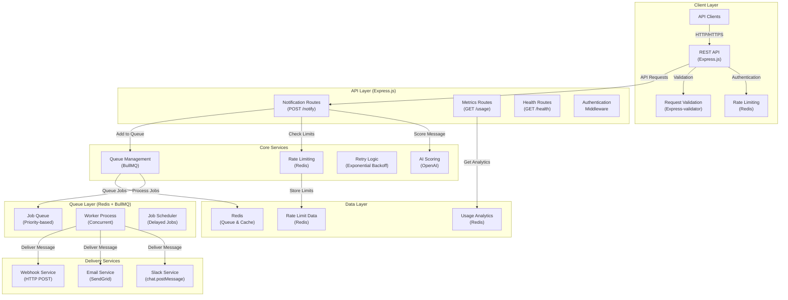
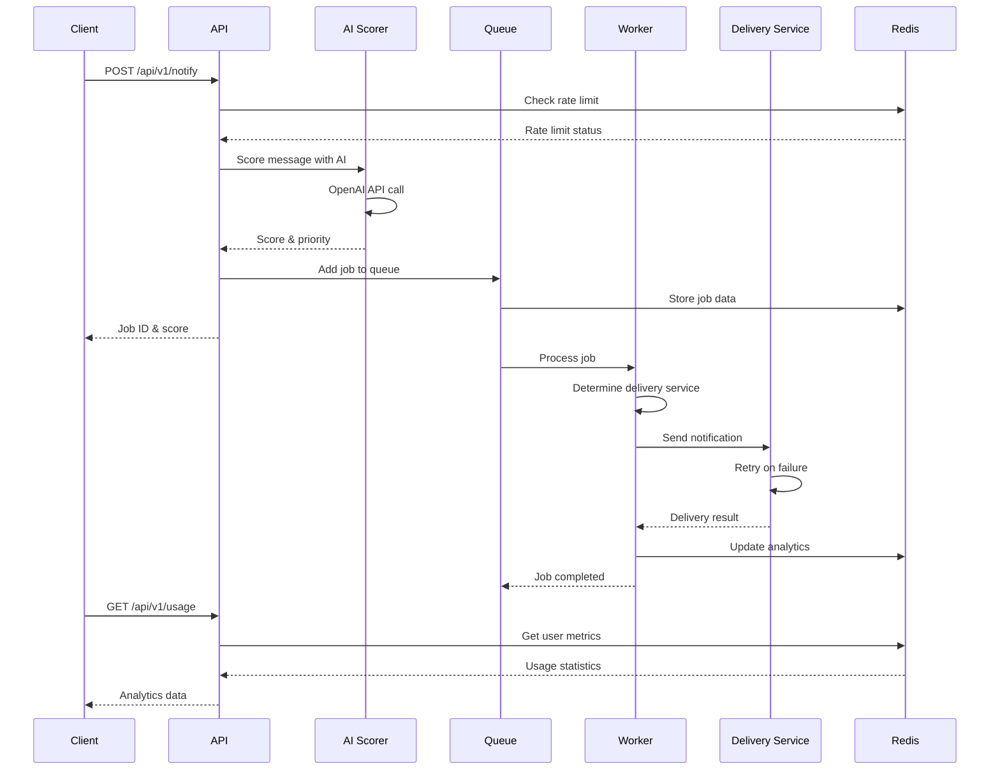

# AI Notifier

A production-ready AI-driven notification platform built with Node.js and TypeScript. Features intelligent message scoring using OpenAI, multi-channel delivery (Slack, Email, Webhook), Redis-based job queuing, rate limiting, and comprehensive analytics.

---

## Architecture



---

## System Overview

AI Notifier implements a modern microservices architecture with intelligent message processing and reliable delivery across multiple channels:

### **Client Layer**

- **REST API**: Clean HTTP endpoints for notification submission and analytics
- **Rate Limiting**: Per-user sliding window rate limiting (100 requests/hour)
- **Authentication**: User-based API access with configurable authentication
- **Validation**: Comprehensive input validation with detailed error messages

### **API Layer**

- **Notification Routes**: Handle message submission with AI scoring
- **Metrics Routes**: Provide usage statistics and analytics
- **Health Routes**: Kubernetes-ready health checks and monitoring
- **Middleware**: CORS, Helmet security, request logging

### **Core Services**

- **AI Scoring**: OpenAI integration for intelligent message prioritization (0-100 score)
- **Rate Limiting**: Redis-based sliding window algorithm
- **Retry Logic**: Exponential backoff with service-specific retry conditions
- **Queue Management**: BullMQ with priority-based job scheduling

### **Queue Layer**

- **Job Queue**: Redis-backed queue with priority and delay support
- **Worker Process**: Concurrent job processing with configurable concurrency
- **Job Scheduler**: Delayed job execution based on AI score priority

### **Delivery Services**

- **Slack Service**: Rich message formatting with attachments and priority colors
- **Email Service**: SendGrid integration with HTML templates and metadata
- **Webhook Service**: Secure HTTP delivery with validation and retry logic

### **Data Layer**

- **Redis**: Primary storage for queues, caching, and analytics
- **Usage Analytics**: Real-time statistics and delivery metrics
- **Rate Limit Data**: Per-user request tracking and limits

The system supports three delivery channels:

1. **Slack**: Direct message posting with rich formatting and priority indicators
2. **Email**: SendGrid-powered email delivery with HTML templates
3. **Webhook**: HTTP POST delivery to external endpoints

---

## Data Flow



---

## Features

### **AI-Driven Intelligence**

- **OpenAI Integration**: Intelligent message scoring (0-100) based on content and context
- **Priority Classification**: Automatic categorization (low/medium/high/critical)
- **Smart Scheduling**: Priority-based job delays and processing order
- **Context Awareness**: Metadata and channel-specific scoring

### **Multi-Channel Delivery**

- **Slack Integration**: Rich message formatting with attachments and priority colors
- **Email Service**: SendGrid-powered delivery with HTML templates
- **Webhook Support**: HTTP POST delivery to external endpoints
- **Channel-Specific Retry**: Service-specific retry conditions and error handling

### **Reliability & Performance**

- **Redis Queue**: BullMQ-based job queuing with persistence
- **Exponential Backoff**: Configurable retry logic with service-specific conditions
- **Rate Limiting**: Per-user sliding window rate limiting
- **Graceful Shutdown**: Proper cleanup and job preservation

### **Production Features**

- **Docker Support**: Multi-stage builds with health checks
- **Kubernetes Ready**: Liveness and readiness probes
- **Comprehensive Logging**: Structured JSON logging with Winston
- **Monitoring**: Health checks, metrics, and analytics endpoints
- **Security**: Helmet security headers, CORS, input validation

### **Developer Experience**

- **TypeScript**: Full type safety and modern development
- **Clean Architecture**: Modular design with clear separation of concerns
- **Testing**: Jest setup with unit test examples
- **Documentation**: Comprehensive API documentation and examples

---

## Quick Start

### Prerequisites

- Node.js 18+
- Redis 7+
- OpenAI API key
- (Optional) Slack Bot Token
- (Optional) SendGrid API key

### Local Development

1. **Clone and install:**

   ```bash
   git clone <repository>
   cd ai-notifier
   npm install
   ```

2. **Configure environment:**

   ```bash
   cp env.example .env
   # Add your OpenAI API key and other credentials
   ```

3. **Start with Docker:**

   ```bash
   docker-compose up -d
   ```

4. **Send a notification:**
   ```bash
   curl -X POST http://localhost:3000/api/v1/notify \
     -H "Content-Type: application/json" \
     -H "X-User-ID: user123" \
     -d '{
       "userId": "user123",
       "channel": "slack",
       "message": "Critical system alert: Database connection failed",
       "metadata": {"urgency": "critical"},
       "target": "#alerts"
     }'
   ```

### Production Deployment

```bash
# Build and run with Docker
docker build -t ai-notifier .
docker run -p 3000:3000 --env-file .env ai-notifier
```

---

## API Reference

### Send Notification

```http
POST /api/v1/notify
Content-Type: application/json
X-User-ID: your-user-id

{
  "userId": "user123",
  "channel": "slack",
  "message": "Critical system alert: Database connection failed",
  "metadata": {
    "urgency": "critical",
    "service": "database"
  },
  "target": "#alerts"
}
```

**Response:**

```json
{
  "success": true,
  "message": "Notification queued successfully",
  "data": {
    "jobId": "job_123",
    "score": 85,
    "priority": "high",
    "reasoning": "This is a critical system alert",
    "estimatedDelivery": "immediate"
  }
}
```

### Get Usage Statistics

```http
GET /api/v1/usage?period=24h
X-User-ID: your-user-id
```

**Response:**

```json
{
  "success": true,
  "data": {
    "userId": "user123",
    "period": "24h",
    "summary": {
      "totalNotifications": 58,
      "avgScore": 73.5,
      "successRate": 98.2,
      "activeJobs": 2,
      "failedJobs": 1
    },
    "breakdown": {
      "slack": 40,
      "email": 10,
      "webhook": 8
    }
  }
}
```

### Health Checks

- `GET /health` - Basic health check
- `GET /health/detailed` - Detailed service status
- `GET /health/ready` - Kubernetes readiness probe
- `GET /health/live` - Kubernetes liveness probe

---

## Configuration

### Environment Variables

| Variable                  | Description         | Default                  |
| ------------------------- | ------------------- | ------------------------ |
| `NODE_ENV`                | Environment         | `development`            |
| `PORT`                    | Server port         | `3000`                   |
| `REDIS_URL`               | Redis connection    | `redis://localhost:6379` |
| `OPENAI_API_KEY`          | OpenAI API key      | **Required**             |
| `OPENAI_MODEL`            | AI model to use     | `gpt-4`                  |
| `SLACK_BOT_TOKEN`         | Slack bot token     | Optional                 |
| `SENDGRID_API_KEY`        | SendGrid API key    | Optional                 |
| `RATE_LIMIT_MAX_REQUESTS` | Rate limit per hour | `100`                    |

### AI Scoring

The platform uses OpenAI to score notification importance:

- **Score 0-100**: Higher scores = higher priority
- **Priority Levels**: low, medium, high, critical
- **Delivery Timing**: Based on score (immediate to 30min delay)

---

## Monitoring & Analytics

### Health Checks

- **Basic Health**: Service status and uptime
- **Detailed Health**: Redis, queue, worker, and service status
- **Kubernetes Probes**: Ready and liveness endpoints

### Metrics

- **Usage Statistics**: Per-user notification counts and scores
- **Queue Statistics**: Job counts and processing rates
- **Channel Breakdown**: Delivery statistics by channel
- **Success Rates**: Delivery success and failure rates

### Logging

- **Structured Logging**: JSON format with correlation IDs
- **Request Logging**: HTTP request/response logging
- **Error Tracking**: Comprehensive error logging with context
- **Performance Metrics**: Response times and processing durations

---

## Development

### Project Structure

```
ai-notifier/
├── src/
│   ├── api/              # Express routes and middleware
│   │   ├── index.ts      # Main router setup
│   │   └── routes/       # API route handlers
│   ├── core/             # AI scoring, rate limiting, retry logic
│   │   ├── scorer.ts     # OpenAI integration
│   │   ├── limiter.ts    # Rate limiting
│   │   └── retry.ts      # Retry utilities
│   ├── queue/            # Redis queue setup and worker
│   │   ├── queue.ts      # BullMQ queue manager
│   │   └── worker.ts     # Job processor
│   ├── services/         # Delivery services
│   │   ├── slack.ts      # Slack integration
│   │   ├── email.ts      # SendGrid email
│   │   └── webhook.ts    # Webhook delivery
│   ├── config/           # Environment config
│   ├── utils/            # Logging and utilities
│   └── app.ts            # Main application
├── tests/                # Test files
├── docker-compose.yml    # Local development
├── Dockerfile           # Production build
└── package.json
```

### Testing

```bash
# Run all tests
npm test

# Run with coverage
npm run test:coverage

# Run specific test
npm test -- --testNamePattern="scorer"
```

### Docker Development

```bash
# Start all services
docker-compose up -d

# View logs
docker-compose logs -f notifier

# Stop services
docker-compose down
```

---

## Production Considerations

### Scaling

- **Horizontal Scaling**: Run multiple worker instances
- **Redis Cluster**: For high availability
- **Load Balancing**: Use nginx or similar
- **Monitoring**: Prometheus + Grafana

### Security

- **Rate Limiting**: Per-user request limits
- **Input Validation**: Comprehensive request validation
- **CORS Configuration**: Configurable cross-origin policies
- **Security Headers**: Helmet integration

### Deployment

```yaml
# Kubernetes example
apiVersion: apps/v1
kind: Deployment
metadata:
  name: ai-notifier
spec:
  replicas: 3
  selector:
    matchLabels:
      app: ai-notifier
  template:
    metadata:
      labels:
        app: ai-notifier
    spec:
      containers:
        - name: notifier
          image: ai-notifier:latest
          ports:
            - containerPort: 3000
          env:
            - name: REDIS_URL
              value: "redis://redis-cluster:6379"
          livenessProbe:
            httpGet:
              path: /health/live
              port: 3000
          readinessProbe:
            httpGet:
              path: /health/ready
              port: 3000
```

---

## Contributing

1. Fork the repository
2. Create a feature branch
3. Make your changes
4. Add tests
5. Submit a pull request

---

## License

MIT License - see LICENSE file for details.

---

Built with ❤️ using TypeScript, Express.js, BullMQ, and OpenAI.
