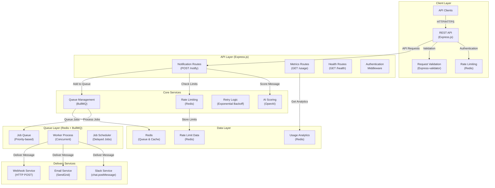
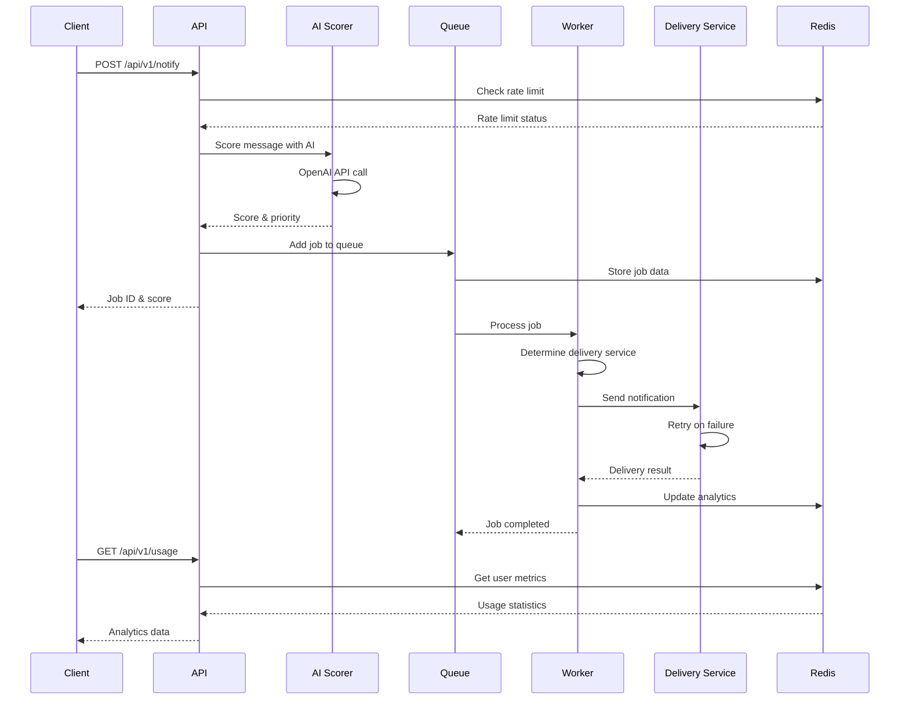

# NotifyAI

A production-ready AI-driven notification platform built with Node.js and TypeScript. Features intelligent message scoring using OpenAI, multi-channel delivery (Slack, Email, Webhook), Redis-based job queuing, rate limiting, and comprehensive analytics.

---

## Architecture

---

## System Overview

AI Notifier implements a modern microservices architecture with intelligent message processing and reliable delivery across multiple channels:

### **Client Layer**

- **REST API**: Clean HTTP endpoints for notification submission and analytics
- **Rate Limiting**: Per-user sliding window rate limiting (100 requests/hour)
- **Authentication**: User-based API access with configurable authentication
- **Validation**: Comprehensive input validation with detailed error messages

### **API Layer**

- **Notification Routes**: Handle message submission with AI scoring
- **Metrics Routes**: Provide usage statistics and analytics
- **Health Routes**: Kubernetes-ready health checks and monitoring
- **Middleware**: CORS, Helmet security, request logging

### **Core Services**

- **AI Scoring**: OpenAI integration for intelligent message prioritization (0-100 score)
- **Rate Limiting**: Redis-based sliding window algorithm
- **Retry Logic**: Exponential backoff with service-specific retry conditions
- **Queue Management**: BullMQ with priority-based job scheduling

### **Queue Layer**

- **Job Queue**: Redis-backed queue with priority and delay support
- **Worker Process**: Concurrent job processing with configurable concurrency
- **Job Scheduler**: Delayed job execution based on AI score priority

### **Delivery Services**

- **Slack Service**: Rich message formatting with attachments and priority colors
- **Email Service**: SendGrid integration with HTML templates and metadata
- **Webhook Service**: Secure HTTP delivery with validation and retry logic

### **Data Layer**

- **Redis**: Primary storage for queues, caching, and analytics
- **Usage Analytics**: Real-time statistics and delivery metrics
- **Rate Limit Data**: Per-user request tracking and limits

The system supports three delivery channels:

1. **Slack**: Direct message posting with rich formatting and priority indicators
2. **Email**: SendGrid-powered email delivery with HTML templates
3. **Webhook**: HTTP POST delivery to external endpoints

---

## Data Flow

---

## Features

### **AI-Driven Intelligence**

- **OpenAI Integration**: Intelligent message scoring (0-100) based on content and context
- **Priority Classification**: Automatic categorization (low/medium/high/critical)
- **Smart Scheduling**: Priority-based job delays and processing order
- **Context Awareness**: Metadata and channel-specific scoring

### **Multi-Channel Delivery**

- **Slack Integration**: Rich message formatting with attachments and priority colors
- **Email Service**: SendGrid-powered delivery with HTML templates
- **Webhook Support**: HTTP POST delivery to external endpoints
- **Channel-Specific Retry**: Service-specific retry conditions and error handling

### **Reliability & Performance**

- **Redis Queue**: BullMQ-based job queuing with persistence
- **Exponential Backoff**: Configurable retry logic with service-specific conditions
- **Rate Limiting**: Per-user sliding window rate limiting
- **Graceful Shutdown**: Proper cleanup and job preservation

### **Production Features**

- **Docker Support**: Multi-stage builds with health checks
- **Kubernetes Ready**: Liveness and readiness probes
- **Comprehensive Logging**: Structured JSON logging with Winston
- **Monitoring**: Health checks, metrics, and analytics endpoints
- **Security**: Helmet security headers, CORS, input validation

### **Developer Experience**

- **TypeScript**: Full type safety and modern development
- **Clean Architecture**: Modular design with clear separation of concerns
- **Testing**: Jest setup with unit test examples
- **Documentation**: Comprehensive API documentation and examples
